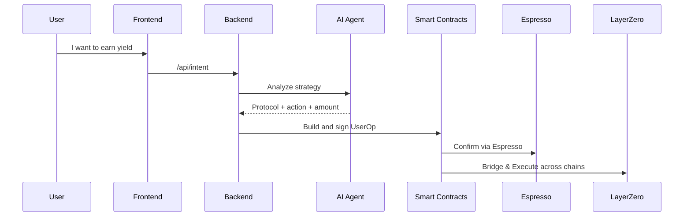

# 💸 SafeYield AI Wallet

> **Your AI-Powered Cross-Chain Wallet for Smarter DeFi Yield**

---

## ❓ Problem Statement

Despite the explosion of DeFi protocols, users face critical limitations:

- 🧩 Yield fragmentation across chains and protocols
- 🤯 High research overhead for strategy optimization
- 🛠️ No smart automation tools in self-custodial wallets

---

## ✅ Solution: SafeYield AI Wallet

**SafeYield** is an **intent-powered, self-custodial smart wallet** that leverages:

- 🤖 **AI Agents** for personalized DeFi recommendations
- 🧠 **Account Abstraction (ERC-4337)** for flexible execution
- ⛓ **Espresso Sequencer + LayerZero** for cross-chain intents

It's the ultimate wallet for users who want to **earn more, manage less**.

---

## 🏆 Hackathon Tracks Covered

| Track                               | Implementation Highlights                             |
| ----------------------------------- | ----------------------------------------------------- |
| ✅ Best Composable App ($35K)       | Modular vaults + LayerZero cross-chain execution      |
| ✅ Open Intents Applications ($30K) | Intent architecture using Espresso + ERC-7683 routing |
| ✅ AI + Wallet UI Integration       | Natural language input → UserOperation pipeline       |

---

## 🧠 Architecture Overview

```mermaid
flowchart TD
  U[User (Intent Input)] --> FE[Frontend (Next.js)]
  FE --> BE[Backend (Express.js)]
  BE --> AI[AI Agent (LangChain + GPT)]
  AI --> BE
  BE --> SC[Smart Contracts (Foundry)]
  SC --> EP[EntryPoint (ERC-4337)]
  SC --> ESP[Espresso Sequencer]
  SC --> LZ[LayerZero Bridge]
  SC --> PROTO[DeFi Protocols (Aave, Uniswap)]
```

---

## ⚙️ Tech Stack

| Layer           | Technology Stack                                               |
| --------------- | -------------------------------------------------------------- |
| Smart Contracts | **Solidity (Foundry)** with EIP-4337, modular yield strategies |
| Frontend        | **Next.js**, **RainbowKit**, **Shadcn UI**, **Wagmi**          |
| Backend         | **Node.js**, **Express**, **PostgreSQL**, **OpenAI API**       |
| AI Layer        | **LangChain**, **GPT-4**, (mock fallback available)            |
| Web3 Stack      | **Ethers.js**, **Account Abstraction**, **LayerZero SDK**      |
| Sequencer       | **Espresso HotShot** for fast settlement                       |

---

## 🔍 Core Features

| Category            | Description                                                               |
| ------------------- | ------------------------------------------------------------------------- |
| 🧠 AI Yield Engine  | Personalized yield plans based on risk, TVL, and chain latency            |
| ✨ Intent Framework | Parse “stake 100 USDC” and convert to valid `UserOperation`               |
| 🔁 Vault System     | Modular contracts with deposit/withdraw + plugin yield strategies         |
| 🔐 Passkey Auth     | WebAuthn-like biometric authentication integrated with Smart Wallet logic |
| ⛓️ Cross-Chain      | Bridge + yield via LayerZero + Espresso confirmations                     |
| 📈 Dashboard-ready  | Real-time analytics of user earnings & yield strategy performance         |

---

## 📁 Repo Structure

```bash
SafeYield-AI-Wallet/
│
├── contracts/        # Foundry-based smart contracts (Vault, Wallet, Executor...)
├── backend/          # Express.js backend: AI, bundler, auth, and logic routing
├── frontend/         # Next.js frontend: WalletConnect, intents UI, dashboards
├── shared/           # Common ABI, constants, helpers (if needed)
├── .env.example      # Example env vars (OpenAI, bundler, LayerZero)
└── README.md         # You’re here!
```

---

## 🔄 Intents Lifecycle



---

## 🧪 Local Setup

### 1. Smart Contracts

```bash
cd contracts/
forge install
forge build
forge test -vvvv
```

### 2. Backend

```bash
cd backend/
npm install
npm run dev
```

### 3. Frontend

```bash
cd frontend/
npm install
npm run dev
```

Then open: [http://localhost:3000](http://localhost:3000)

---

## 🧠 AI Agent (LangChain / GPT)

- Natural language intent input
- Simulates or queries on-chain portfolio
- Maps to yield strategies (Aave, Curve, etc.)
- Output structured as:

```json
{
  "action": "stake",
  "amount": "100",
  "token": "USDC",
  "protocol": "Aave"
}
```

This is passed to `userOpBuilder.js` for encoding and bundling.

---

## 🔐 Authentication Flow

- ✅ User signs up using passkey (WebAuthn)
- ✅ Signature is verified by `AuthenticationManager.sol`
- ✅ UserOperation is only valid with correct passkey hash
- ✅ This removes the need for private key signing

---

## 📦 Integration Points

| Component           | Description                            |
| ------------------- | -------------------------------------- |
| Bundler (Etherspot) | Accepts signed `UserOperation`         |
| Espresso Sequencer  | Inclusion check + settlement           |
| LayerZero           | Cross-chain dispatch of intent actions |
| RainbowKit          | WalletConnect UI for login and auth    |

---

## 🚀 Future Roadmap

- 🧬 zk-rollup integration for private yield flows
- 🪙 Real DeFi protocol plugin system for vaults
- 🧠 Fine-tune GPT model for DeFi-specific intents
- 📲 Mobile version with biometric flow + push notif

---

## 🔒 Security & Auditing (Planned)

- All contracts designed for modular upgradability
- Passkey-based login reduces key theft risk
- Plan to run MythX/Slither static audits before production

---

## 📹 Demo Video (Add before submission)

> _Please include a short demo video (~1–3 mins)_  
> showing: AI → intent → execution → yield dashboard.

---

## 👩‍💻 Built With Love by

**[@samarabdelhameed](https://github.com/samarabdelhameed)**  
_DoraHacks Build & Brew Hackathon 2025 – Espresso Network_

---

## 📜 License

MIT © 2025 SafeYield AI Wallet

```

```
