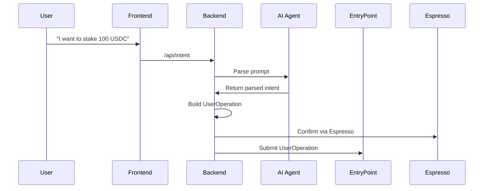

# 🔐 SafeYield AI Wallet — Backend

The backend powering **SafeYield AI Wallet**, an EIP-4337-compliant smart wallet that leverages **AI agents**, **Open Intents**, and **Espresso Sequencer** to allow users to interact with DeFi using simple natural language.

---

## 🚀 Features

- ✅ **Passkey Authentication (WebAuthn / FIDO2)**
- ✅ **Natural Language Intents** (e.g. _"Stake 100 USDC in Aave"_)
- ✅ **AI-Powered Recommendations** for optimal protocol & strategy
- ✅ **EIP-4337 `UserOperation` Generation**
- ✅ **Espresso Integration** for intent inclusion confirmation

---

## 🧱 Tech Stack

| Layer     | Stack                                    |
| --------- | ---------------------------------------- |
| Server    | Node.js + Express.js                     |
| AI Engine | OpenAI (mocked for now)                  |
| Intents   | ERC-7683 compatible format               |
| Auth      | Passkeys (WebAuthn via `fido2-lib`)      |
| Bundler   | Stackup Bundler / Etherspot              |
| Sequencer | [Espresso Systems](https://espresso.xyz) |
| Database  | MongoDB (optional)                       |

---

## 📦 Folder Structure

```
backend/
│
├── controllers/
│   ├── authController.js
│   ├── intentController.js
│   ├── recommendationController.js
│   └── espressoController.js
│
├── routes/
│   ├── auth.js
│   ├── intent.js
│   ├── recommendation.js
│   └── espresso.js
│
├── services/
│   ├── aiAgent.js             # AI agent that parses intents
│   ├── bundlerService.js      # Sends UserOps to bundler
│   ├── userOpBuilder.js       # Generates EIP-4337 ops
│   └── espressoInclusion.js   # (Mocked) Espresso inclusion checker
│
├── models/                    # (Optional)
│   ├── User.js
│   └── Transaction.js
│
├── utils/
│   └── logger.js
│
├── config/
│   ├── dotenv.js
│   └── db.js
│
├── app.js         # Express app setup
├── server.js      # App entry point
├── .env.example
└── package.json
```

---

## 🔐 Passkey Authentication (WebAuthn)

> Optional but secure — enables biometric login

1. User signs in via browser WebAuthn.
2. Challenge is validated via FIDO2.
3. `authController.js` stores FIDO credential.
4. Used as signature validator for future `UserOperation`s.

---

## 🧠 AI Agent — `aiAgent.js`

The AI logic is mocked (until OpenAI budget is ready), and simulates intent parsing:

```json
{
  "action": "stake",
  "token": "USDC",
  "amount": "100",
  "protocol": "Aave"
}
```

This parsed intent is forwarded to `userOpBuilder.js`.

---

## 🧱 Building UserOperation — `userOpBuilder.js`

We encode a simplified version of EIP-4337 `UserOperation`:

- Hardcoded selectors for actions (`deposit()`, `stake()`, etc)
- Token amount encoded as 32-byte hex
- Sender passed from frontend

```json
{
  "sender": "0x...",
  "callData": "0xa694fc3a...000056bc...",
  "signature": "valid-passkey"
}
```

---

## ☕ Espresso Inclusion — `espressoController.js`

We currently **mock the inclusion check** by:

1. Sending `eth_chainId` to validate Espresso is reachable
2. Returning mock response for `userOpHash` inclusion
3. Endpoint: `POST /api/espresso/confirm`

---

## 🧭 Intents to Execution Flow



---

## 🧩 Smart Contract Integration

This backend is tightly coupled with smart contracts built using Foundry:

| Contract                    | Responsibility                         |
| --------------------------- | -------------------------------------- |
| `IntentExecutor.sol`        | Executes action from parsed intent     |
| `SafeYieldVault.sol`        | Handles yield logic (deposit/redeem)   |
| `AuthenticationManager.sol` | Verifies passkey signer on-chain       |
| `SafeYieldWallet.sol`       | Entry point wallet compliant with 4337 |
| `EntryPoint.sol`            | Validates and executes UserOps         |

---

## ✅ Hackathon Tracks Covered

| Track                         | Status | Details                             |
| ----------------------------- | ------ | ----------------------------------- |
| 🟢 Open Intents Applications  | ✅     | `POST /api/intent` → EIP-4337 flow  |
| 🟢 AI + Wallet UI Integration | ✅     | AI picks strategy + Passkey auth    |
| 🟢 Core Espresso Challenge    | ✅     | Mocked Espresso confirm, real RPC   |
| 🟢 Best Composable DeFi Apps  | ✅     | Intent selects Aave, Compound, etc. |

---

## 🧪 Testing (Postman)

You can test everything using [Postman](https://postman.com):

### Sample `POST /api/intent`

```json
{
  "userAddress": "0x1234567890abcdef...",
  "intentText": "I want to deposit 0.1 ETH in Aave"
}
```

✅ Response includes:

- Parsed intent
- Generated userOperation
- Espresso confirmation

---

## 📄 .env.example

```env
OPENAI_API_KEY=your-openai-key
BUNDLER_URL=https://testnet-rpc.etherspot.io/v2/...
ENTRY_POINT_ADDRESS=0x0576a...
ESPRESSO_URL=https://milan-devnet.rpc.caldera.xyz
MONGODB_URI=mongodb://localhost:27017/safeyield
```

---

## 🧪 Running Locally

```bash
git clone https://github.com/YOUR_REPO/SafeYield-AI-Wallet.git
cd backend
cp .env.example .env
npm install
npm run dev
```

Then test via Postman or frontend form.

---

## 👩‍💻 Author

Crafted with ❤️ by [@samarabdelhameed](https://github.com/samarabdelhameed)  
Made for the **DoraHacks Build & Brew** hackathon 🚀
