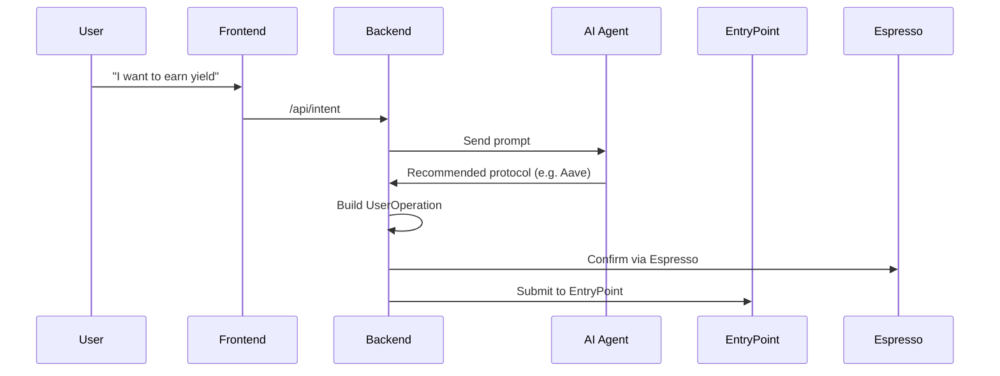

## 🔍 Overview

This backend is the core engine powering the **SafeYield AI Wallet**, enabling users to:

- ✅ Authenticate via **Passkeys/WebAuthn**
- ✅ Submit **natural language intents** (e.g. “I want to stake my USDC”)
- ✅ Get real-time **DeFi protocol recommendations** via an AI agent
- ✅ Encode and dispatch **EIP-4337-compliant UserOperations**
- ✅ Integrate with **Espresso Sequencer** for fast & secure intent confirmations

---

## 🛠️ Tech Stack

| Layer         | Tech                                     |
| ------------- | ---------------------------------------- |
| Server        | Node.js + Express.js                     |
| AI Engine     | OpenAI API + LangChain (Agent)           |
| Auth          | Passkey/WebAuthn + FIDO2                 |
| Intents       | ERC-7683-compatible                      |
| Sequencer     | [Espresso Systems](https://espresso.xyz) |
| DB (optional) | MongoDB or PostgreSQL                    |

---

## 🧭 API Endpoints

| Method | Endpoint                | Purpose                                 |
| ------ | ----------------------- | --------------------------------------- |
| POST   | `/api/auth/passkey`     | Register/login via Passkey (WebAuthn)   |
| POST   | `/api/intent`           | Parse user's natural language intent    |
| POST   | `/api/recommendation`   | Return best protocol via AI agent       |
| POST   | `/api/espresso/confirm` | Validate & confirm intent with Espresso |

---

## 🤖 AI Agent

The backend calls an AI agent that:

- Reads portfolio data (optionally from frontend or DB)
- Understands intents like "stake 100 USDC"
- Selects best DeFi strategy (e.g., Aave, Compound)
- Returns intent metadata: token, action, value, protocol

The agent output is then transformed into an EIP-4337 `UserOperation`.

---

## 🔐 Authentication Flow (Passkey / WebAuthn)

1. Frontend registers user via browser WebAuthn
2. Sends result to `POST /api/auth/passkey`
3. Server verifies signature + stores `verifier` for the user
4. Passkey becomes the only credential to validate UserOps

---

## 🔄 Intents to Execution Flow



---

## 📁 Folder Structure

```
backend/
│
├── controllers/
│   ├── authController.js
│   ├── intentController.js
│   ├── recommendationController.js
│   └── espressoController.js
│
├── routes/
│   ├── auth.js
│   ├── intent.js
│   ├── recommendation.js
│   └── espresso.js
│
├── services/
│   ├── userOpBuilder.js       # Generates EIP-4337 ops
│   ├── bundlerService.js      # Sends ops to bundler
│   └── aiAgent.js             # Interfaces with OpenAI
│
├── models/
│   ├── User.js
│   └── Transaction.js
│
├── utils/
│   └── logger.js
│
├── config/
│   ├── db.js
│   └── dotenv.js
│
├── app.js         # Express instance + middleware
├── server.js      # Server entry point
├── .env.example
└── package.json
```

---

## 💡 Integration with Smart Contracts

This backend tightly integrates with custom smart contracts built using **Foundry**, such as:

| Contract                    | Description                               |
| --------------------------- | ----------------------------------------- |
| `IntentExecutor.sol`        | Executes low-level calldata from intent   |
| `SafeYieldVault.sol`        | Handles yield deposits & rewards          |
| `SafeYieldWallet.sol`       | Smart Wallet (ERC-4337)                   |
| `AuthenticationManager.sol` | Passkey authentication & mapping          |
| `EntryPoint.sol` (4337)     | Handles validation and execution bundling |

---

## 🧩 Open Intents Framework

This backend supports **ERC-7683** concepts via:

- `POST /api/intent` as an intent parser
- `IntentExecutor.sol` as the intent executor
- `userOpBuilder.js` to encode the action
- Espresso as the sequencer before finalization

---

## 🏆 Hackathon Tracks Covered

| Track                         | Covered? |
| ----------------------------- | -------- |
| ✅ Open Intents Applications  | ✅       |
| ✅ AI + Wallet UI Integration | ✅       |
| ✅ Core Espresso Challenge    | ✅       |
| ✅ Best Composable DeFi Apps  | ✅       |

---

## 🚀 Running Locally

```bash
cd backend
npm install
npm run dev
```

Set your `.env` file using `.env.example`. You’ll need:

- OpenAI API Key
- MongoDB URL
- RPC URL
- Espresso node URL (optional)

Test via [Postman](https://postman.com) or cURL.

---

## 👩‍💻 Author

Crafted with ❤️ by [@samarabdelhameed](https://github.com/samarabdelhameed)

---

```

```
